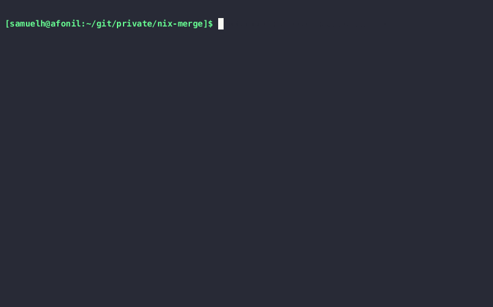

<br />
<div align="center">
  <h1 align="center">Nix-Merge</h1>
  <p align="center">
    Easily move your `nix-env` packages into your global configuration!
  </p>
</div>

# About The Project

Nix-merge helps you move all your quickly installed packages from `nix-env` into your global configuration.
Just select the packages you want to *migrate* and *remove* and it does the rest.



# Getting Started

The script is currently not (yet) packaged for NixOS. The only way is to run it as a flake:

## nix run

```bash
$ nix run github:Melkor333/nix-merge#. PATH-TO-YOUR-NIXOS-CONFIG
# If you don't have the experimental features enabled:
nix --extra-experimental-features "nix-command flakes" run github:Melkor333/nix-merge#. PATH-TO-YOUR-NIXOS-CONFIG
```

## Install

TODO

## Usage

```
Usage: nix-merge [OPTION]... FILE
Migrate all your nix-env packages to a configuration file

  -a --all            Just select *all* files. otherwise you will be asked
  -d --descriptions   Ask for an optional description for each package to be added as comment

  FILE                Should be a nix configuration file e.g.:
                      /etc/nixos/configuration.nix
                      $HOME/.config/home-manager/home.nix
                      This file should contain the following line.
                      new packages will be inserted after this line.
                      Note that if the line is indented, indentation will
                      be used during insertion

                      $BEGIN


CACHE FILES:
$HOME/.local/share/nix-merge/packages.cache
                    Stores a list of all existing packages it can find


$HOME/.local/share/nix-merge/attrsets.cache
                    Stores the current status of packages-names and what
                    packages are yet to be handled in case of early cancel
```

## License

Distributed under the MIT License. See [LICENSE](./LICENSE) for more information.
